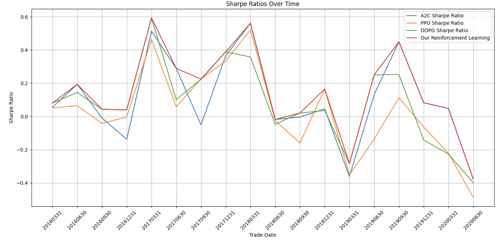

# Reinforcement Learning Model Comparison

This study employs a dynamic strategy leveraging a quarterly rolling window to evaluate and select among three prominent reinforcement learning models—PPO, A2C, and DDPG—based on their Sharpe Ratios. Our primary goal is to identify and utilize the model which exhibits the highest Sharpe Ratio at the conclusion of each period to refine our trading strategy. 

## Overview

We established a test set with a rolling window of one quarter to assess the models mentioned. By selecting the top-performing model at each validation point, we have been able to dynamically adjust our strategy based on the most current data. 

### Data Source

We utlized the financial market data on Kaggle for this reinforcement learning algorithm. <br> Link: https://www.kaggle.com/datasets/alincijov/trading

References:<br>
Hongyang Yang, Xiao-Yang Liu, Shan Zhong, and Anwar Walid. 2020. Deep Reinforcement Learning for Automated Stock Trading: An Ensemble Strategy.<br>
In ICAIF ’20: ACM International Conference on AI in Finance, Oct. 15–16, 2020, Manhattan, NY. ACM, New York, NY, USA.

### Sharpe Ratio Performance



*Figure 1: Sharpe ratios of three different reinforcement learning models—A2C, PPO, and DDPG—across various rolling validation periods.*

As illustrated in Figure 1, each model shows distinctive performance patterns over the quarters from March 2016 to June 2020. The A2C model frequently achieves the highest peaks, notably reaching a Sharpe Ratio of 0.561 on 2018-03-31 but also experiences significant dips, plummeting to a low of -0.377 on 2020-06-30, indicating its high volatility. In contrast, the PPO model exhibits more stable but moderate fluctuations, whereas the DDPG occasionally lags behind the other two, especially noted in late 2020.

### Adaptive Strategy

The strategy, as highlighted by the "Our Reinforcement Learning" line (red), adjusts by selecting the model with the highest Sharpe Ratio at each validation point. This method aims to optimize returns by efficiently managing risks and underscores the importance of adaptability to changing market conditions. For instance, this approach was particularly effective in late 2018 when it mirrored the A2C model’s rebound to approximately 0.6 Sharpe Ratio, showcasing an effective response to market opportunities.

## Data and Performance Table

Below is a table that presents the Sharpe Ratios for A2C, PPO, and DDPG models over time:

```plaintext
+----------------+----------+---------+----------+----------+
| Date           | A2C SR   | PPO SR  | DDPG SR  | Max SR   |
+----------------+----------+---------+----------+----------+
| 2016-03-31     | 0.056    | 0.051   | 0.081    | 0.081    |
| 2016-06-30     | 0.193    | 0.065   | 0.144    | 0.193    |
| 2016-09-30     | -0.010   | -0.042  | 0.043    | 0.043    |
| 2016-12-31     | -0.138   | -0.003  | 0.039    | 0.039    |
| 2017-03-31     | 0.513    | 0.465   | 0.592    | 0.592    |
| ...            | ...      | ...     | ...      | ...      |
| 2020-06-30     | -0.377   | -0.487  | -0.398   | -0.377   |
+----------------+----------+---------+----------+----------+
```
## Conclusion

The quantitative analysis from this study confirms that selecting models based on the highest quarterly Sharpe Ratio effectively leverages the strengths of each model, optimizing returns while managing associated market risks. The success of this adaptive model selection strategy highlights the potential of reinforcement learning in developing sophisticated, responsive trading algorithms in volatile financial environments.
